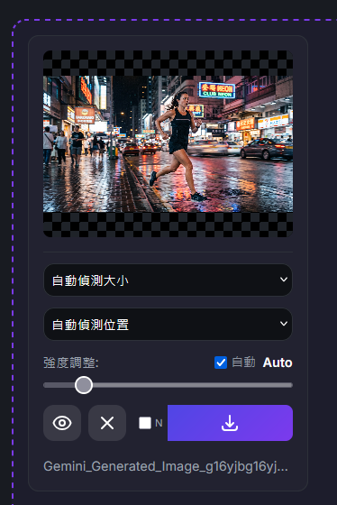

# 巴娜娜去水印&微調整ツール

[](https://opensource.org/licenses/MIT)

[English](README.md) | [繁體中文](README_zh-TW.md) | [简体中文](README_zh-CN.md) | [日本語](README_ja.md) | [한국어](README_ko.md)

Google Geminiが生成した画像から透かしを除去するために設計された強力なウェブツールです。このツールはブラウザ上で完全に動作するため、画像がサーバーにアップロードされることはなく、プライバシーが保護されます。

## 🎯 原版との違い
このプロジェクトは透かし除去に特化した**改変版**で、ロゴカスタマイズ機能が強化されています。

## 🖼️ デモ

<div align="center">
  
  
  
</div>

## ✨ 主な機能

- **🚫 自動透かし除去**：逆アルファブレンドアルゴリズム（Reverse Alpha Blending）と多次元自動強度検出を使用して、透かしで覆われたピクセルを正確に復元します。
  - 検索範囲：0.05～2.0（旧バージョン：0.1～1.2）
  - 検索精度：0.01（旧バージョン：0.02の2倍）
  - 多次元評価：輝度均一性、エッジブレンディング、ピーク検出
- **🎨 スマートロゴオーバーレイ**：ロゴ画像をアップロードすると、透かしの位置に自動配置されます：
  - **自動位置合わせ**：ロゴは検出された透かしの中心に自動配置されます
  - **サイズ統一**：ロゴサイズは画像の短い辺に基づいて計算されます（横向き/縦向きで同じサイズ）
  - **調整可能**：透明度 0%～100%（デフォルト 20%）、サイズ 10%～300%（デフォルト 200%）
- **🔧 出力オプション**：
  - **出力リサイズ**：1280×720 / 1920×1080（またはオフ）
  - **EXIF保持**：元の画像メタデータを保持
  - **シャープ**：シャープネスフィルターを適用
  - **ファイル名プレフィックス**：出力ファイル名をカスタマイズ
  - **ソート**：ファイル名または日付でソート（昇順/降順）
- **📥 柔軟なダウンロードオプション**：
  - **ダウンロードタイプ**：
    - **通常版 (R_)**：透かし除去 + リサイズ + ロゴ付き
    - **ミラー版 (M_)**：透かし除去 + リサイズ + 水平反転（ロゴなし）
    - **クリーン版 (N_)**：透かし除去 + リサイズ（ロゴなし）
  - **単一画像**：ダウンロードボタンで各バージョンを取得
  - **一括ダウンロード**：ZIPにはR_とN_の両方が含まれる
- **⚙️ 透かし位置設定**：
  - **自動検出**：画像に基づいて自動的に透かし位置を判断
  - **新版余白**：192px（横向き）/ 96px（縦向き）透かし用
  - **旧版余白**：64px（横向き）/ 32px（縦向き）透かし用
- **🔒 プライバシー優先**：すべての処理はローカルブラウザで行われ、画像がデバイス外に送信されることはありません。
- **⚡ リアルタイムプレビュー**：アップロードと同時に処理され、素早く結果を確認できます。
- **🖱️ ドラッグ＆ドロップ対応**：画像をウィンドウに直接ドラッグして処理できます。
- **👀 比較モード**：処理後の画像を長押しすると元の画像が表示され、除去効果を簡単に比較できます。
- **💡 ライトボックスモード**：画像をクリックして全画面表示を開き、矢印キーまたはキーボードで移動可能
  - **ズーム制御**：マウスホイールでズーム（50%～500%）、ズーム中はドラッグでパン可能
  - **ミラープレビュー**：水平/垂直反転で効果をすばやく確認
  - **回転制御**：90°回転で各角度から確認可能
  - **長押し元画像**：長押しで元画像と比較
- **🌙 ダーク/ライトテーマ**：ワンクリックでダークテーマとライトテーマを切り替え可能。
- **💾 高画質ダウンロード**：PNG（可逆）またはJPEG（圧縮）形式でダウンロード可能。
- **📋 クリップボード貼り付け**：スクリーンショットや画像を直接貼り付け (Ctrl+V) して処理可能。
- **📦 一括 ZIP ダウンロード**：複数の画像をダウンロードする場合、自動的に ZIP ファイルにまとめます。
- **🌐 多言語対応**：英語、繁体字中国語、簡体字中国語、日本語、韓国語に対応。

## 🛠️ 技術的な仕組み

このプロジェクトは純粋な JavaScript（Canvas API）で実装されています。Gemini 透かしのアルファマスクを事前に読み込み、各ピクセルの元の色値を計算して透かしの影響を「逆算」することで、無損失またはほぼ痕跡のない除去効果を実現しています。

## 🚀 使い方

1. **ページを開く**：`index.html` をブラウザで直接開きます。
2. **画像をアップロード**：アップロードエリアをクリックするか、JPG/PNG/WEBP 画像をドラッグします。
3. **結果を確認**：システムは自動的に処理し、結果を表示します。
4. **設定を調整**（必要に応じて）：
   - 「自動」/「新版余白」/「旧版余白」を切り替えて透かし位置を調整
   - 「自動」/「強制小」/「強制大」を切り替えて透かしサイズを調整
   - 強度スライダーを手動でドラッグして除去強度を微調整
5. **ダウンロード**：
   - **単一画像**：「通常」(R_) / 「ミラー」(M_) / 「クリーン」(N_) ボタンをクリックしてダウンロード
   - **一括ダウンロード**：「すべてダウンロード」ボタンをクリック

## 📦 インストールと実行

このプロジェクトは静的ウェブページであり、複雑なバックエンド環境をインストールする必要はありません。

1. **プロジェクトをクローン**：
   ```bash
   git clone https://github.com/aflypenstudio/BananaWatermarkRemover.git
   ```
2. **ディレクトリに移動**：
   ```bash
   cd BananaWatermarkRemover
   ```
3. **実行**：
   ブラウザで `index.html` を直接開いて使用できます。
   *注意：ブラウザのセキュリティポリシー（CORS）により、ローカルファイルを直接開くとマスク画像の読み込みに失敗する場合があります。Pythonを使用して簡易ローカルサーバーを実行することをお勧めします：*
   ```bash
   # Python 3
   python -m http.server 8000
   ```

   その後、ブラウザで `http://localhost:8000` にアクセスしてください。

## 🙏 謝辞

このプロジェクトに貴重な情報とインスピレーションを提供してくれた [GeminiWatermarkTool](https://github.com/allenk/GeminiWatermarkTool) および元プロジェクト [GeminiWatermarkRemove](https://github.com/kevintsai1202/GeminiWatermarkRemove) に深く感謝します。

## 📄 ライセンス

このプロジェクトは MIT ライセンスの下でライセンスされています。詳細については [LICENSE](LICENSE) ファイルを参照してください。